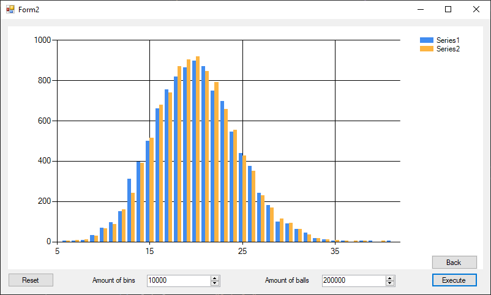

# ExerciseGrapher
  

## The Project
I did this little windows WinForm app to answer this tiny following execise.
It was my first time using Winform and it was a good learning experience even though it's very simple.
The project was originally .Net Framework 4.6 and was later migrated to .Net (core) 5

## The Exercise
Please try the following Monte Carlo simulations:

Consider a system with 10,000 bins (boxes). Randomly dropping balls into those bins: one ball at a time, and each bin has equal probability being selected. After 200,000 balls are dropped (i.e., the average number of balls in each bin is 20), plot the histogram of how many bins have certain number of balls, i.e., the graph of n(k) vs. k. Where n(k) is the number of bins with k balls.

Is the histogram stable? In other words, if you repeat the simulation again, will you get similar histogram?

Try another simulation with 400,000 balls being dropped, and plot the new histogram. What is the relationship of this histogram with the previous one?

Can you fit a function to this histogram?

Then try a different simulation: Initially, put exactly 20 balls in every bins (total of 200,000 balls). For each step, randomly pick one bin and take out one ball, then put the ball into another randomly selected bin. The total number of balls does not change with this procedure. Repeat this process for 1 million times. Now plot the histogram.

Is the histogram stable? Continue this simulation for another 1 million times, and compare the two histograms.

Can you fit a function to this histogram? What is the functional form?

Try a simulation with the initial condition of 40 balls in every bin
## The Tests
  
The CI was just migrated with the project from .Net framework to .Net 5. Since it's WinForm it's still windows only
## The Build
https://github.com/GaetanVigner/ExerciseGrapher/releases/download/1.0/Graph.exe
